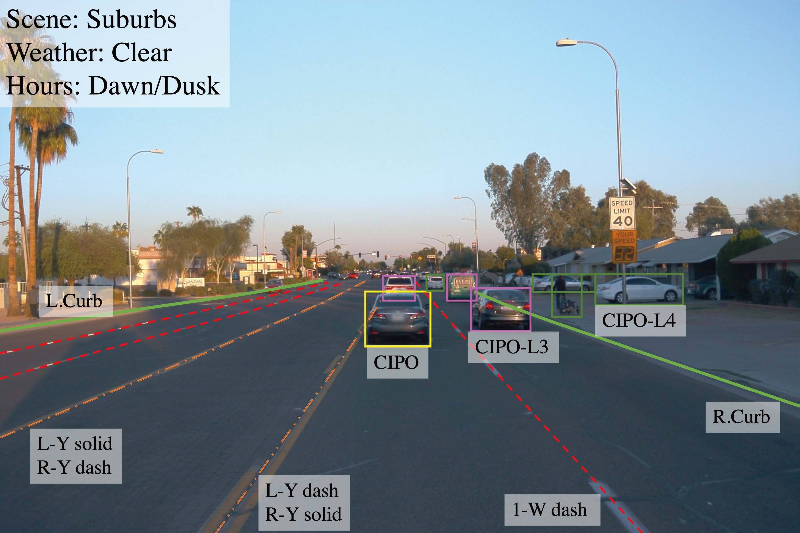

# OpenLane-V1
OpenLane is the first real-world and the largest scaled 3D lane dataset to date. Our dataset collects valuable contents from [public perception dataset](https://waymo.com/open/data/perception/), providing lane and closest-in-path object(CIPO) annotations for **1000** segments. In short, OpenLane owns **200K** frames and over **880K** carefully annotated lanes. We have released the OpenLane Dataset publicly to aid the research community in making advancements in 3D perception and autonomous driving technology. See details in [Paper.](https://arxiv.org/abs/2203.11089)



This repository is organized as the following.

- [Get Started](#get-started)
  - [Download](#download)
  - [Evaluation Kit](#evaluation-kit)
- [Data](#data)
  - [Lane Annotation](#lane-annotation)
  - [CIPO/Scenes Annotation](#ciposcenes-annotation)
- [Benchmark and Leaderboard](#benchmark-and-leaderboard)
  - [Benchmark](#benchmark)
  - [Leaderboard](#leaderboard)
- [Citation](#citation)
- [License](#license)

> Note that our OpenLane is an autonomous driving dataset, while there's another repository with the same name [The-OpenROAD-Project/OpenLane](https://github.com/The-OpenROAD-Project/OpenLane). 

## News
- [2023/03]: We announced a brand-new dataset on scene understanding and are holding a challenge on the dataset, check out on [OpenLane-V2](https://github.com/OpenDriveLab/OpenLane-V2) and [challenge website](https://opendrivelab.com/AD23Challenge.html) :star:.
- [2023/03]: We are maintaining a leaderboard on [paperswithcode](https://paperswithcode.com/sota/3d-lane-detection-on-openlane) :microphone:.
- [2022/11]: We released `v1.2` of the Openlane dataset and features are shown as following.
  - Add frame pose info for sequential research. 
  - [Filter some noise points](https://github.com/OpenDriveLab/OpenLane/issues/23) and [fix coordinate system bug](https://github.com/OpenDriveLab/OpenLane/issues/31).
- [2022/09]: Update evaluation metrics, prune gt points by visibility before evaluation, fixing issue [A question about prune_3d_lane_by_visibility](https://github.com/OpenDriveLab/OpenLane/issues/18).           
- [2022/07]: We released `v1.1` of the Openlane dataset, fixing [3D lane evaluation issues](https://github.com/OpenDriveLab/OpenLane/issues/15) and some json files mismatch.
- [2022/04]: We released v1.0 of the [PersFormer codebase](https://github.com/OpenDriveLab/PersFormer_3DLane), providing a baseline method on OpenLane dataset.
- [2022/03]: We released v1.0 of the Openlane dataset including 1000 segments with labels of 3D/2D lanes and CIPO/Scenes.
  
## Get Started
Please follow these steps to make yourself familiar with the OpenLane dataset. Create an issue if you need any further information.
### Download
You can download the entire OpenLane dataset [here](data/README.md). Note that before using OpenLane dataset, you should register at [Waymo Open Dataset Website](waymo.com/open) and agreed to these Terms since OpenLane is built on top of Waymo Open Dataset.

### Evaluation Kit
We provide evaluation tools on both lane and CIPO, following the same data format as Waymo and common evaluation pipeline in 2D/3D lane detection. Please refer to [Evaluation Kit Instruction](eval/README.md).
  
## Data
OpenLane dataset is constructed on mainstream datasets in the field of autonomous driving. In v1.0, we release the annotation on [Waymo Open Dataset](https://waymo.com/open/data/perception/). In the future we'll update for annotation on [nuScenes](https://www.nuscenes.org/nuscenes). 
OpenLane dataset focuses on lane detection as well as CIPO. We annotate all the lanes in each frame, including those in the opposite direction if no curbside exists in the middle. In addition to the lane detection task, we also annotate: (a) scene tags, such as weather and locations; (b) the CIPO, which is defined as the most concerned target w.r.t. ego vehicle; such a tag is quite pragmatic for subsequent modules as in planning/control, besides a whole set of objects from perception. The introduction about the [coordinates system](./data/Coordinate_Sys.md) can be found here. 

### Lane Annotation
We annotate lane in the following format.
- Lane shape. Each 2D/3D lane is presented as a set of 2D/3D points.
- Lane category. Each lane has a category such as double yellow line or curb.
- Lane property. Some of lanes have a property such as right, left.
- Lane tracking ID. Each lane except curb has a unique id. 

For more annotation criterion, please refer to [Lane Anno Criterion](anno_criterion/Lane/README.md).

### CIPO/Scenes Annotation
We annotate CIPO and Scenes in the following format.
- 2D bounding box with a category representing the importance level of object. 
- Scene Tag. It describes in which scenario this frame is collected.
- Weather Tag. It describes under what weather this frame is collected.
- Hours Tag. It annotates in what time this frame is collected.

For more annotation criterion, please refer to [CIPO Anno Criterion](anno_criterion/CIPO/README.md).
  
## Benchmark and Leaderboard

### Benchmark

We provide an initial benchmark on OpenLane 2D/3D Lane Detection and you are welcome to **pull request** and add your work here! To thoroughly evaluate the model, we provide different case split from the entire validation set. They are Up&Down case, Curve case, Extreme Weather case, Night case, Intersection case, and Merge&Split case. More detail can be found in [Lane Anno Criterion](anno_criterion/Lane/README.md)
Based on the [Lane Eval Metric](eval/LANE_evaluation/README.md), results (**F-Score**) of different 2D/3D methods on different cases are shown as follows. 
- 2D Lane Detection 
  
| Method     | All  | Up&<br>Down | Curve | Extreme<br>Weather | Night | Intersection | Merge&<br>Split |
| :----:     |:----:|:----:|:----:|:----:|:----:|:----:|:----:|
| LaneATT-S  | 28.3 | 25.3 | 25.8 | 32.0 | 27.6 | 14.0 | 24.3 | 
| LaneATT-M  | 31.0 | 28.3 | 27.4 | 34.7 | 30.2 | 17.0 | 26.5 | 
| PersFormer | 42.0 | 40.7 | 46.3 | 43.7 | 36.1 | 28.9 | 41.2 |  
| CondLaneNet-S | 52.3 | 55.3 | 57.5 | 45.8 | 46.6 | 48.4 | 45.5 | 
| CondLaneNet-M | 55.0 | 58.5 | 59.4 | 49.2 | 48.6 | 50.7 | 47.8 | 
|**CondLaneNet-L**|**59.1**|**62.1**|**62.9**|**54.7**|**51.0**|**55.7**|**52.3**|  

- 3D Lane Detection
  
| Method     |Version| All  | Up &<br>Down | Curve | Extreme<br>Weather | Night | Intersection | Merge&<br>Split |  Best model |x-c|x-f|z-c|z-f|Category Accuracy|
| :----:     |:----:|:----:|:----:|:----:|:----:|:----:|:----:|:----:|:----:|:----:|:----:|:----:|:----:|:----:|
| GenLaneNet |1.1| 32.3 | 25.4 | 33.5 | 28.1 | 18.7 | 21.4 | 31.0 |    [model](https://docs.google.com/forms/d/e/1FAIpQLScLRUvr14taMIZzGZs7ZDRIOchPQQ50rdIWyipQeRl2bsO9dQ/viewform?usp=sharing)    |0.593| 0.494|0.140|0.195|/|
| 3DLaneNet  |1.1| 44.1 | 40.8 | 46.5 | 47.5 | 41.5 | 32.1 | 41.7 |    -    | -|-| -|-|-|
|**PersFormer**|1.1|**50.5**|**45.6**|**58.7**|**54.0**|**50.0**|**41.6**|**53.1**|[model](https://drive.google.com/file/d/1TwjmFB3p3luCG8ytZ4MEI-TMoDT2Vn3G/view?usp=share_link)  | 0.319|0.325|0.112|0.141|89.51|
|**PersFormer**|1.2|**52.9**|**47.5**|**58.4**|**51.8**|**47.4**|**42.1**|**50.9**|[model](https://drive.google.com/file/d/1jtDfnxcNNbefgpYGfue1XlvcvtmfPZj7/view?usp=share_link)  | 0.291|0.294| 0.080|0.116|89.24|

The implementation of PersFormer can be found [here](https://github.com/OpenDriveLab/PersFormer_3DLane).

### Leaderboard

For comparison, we provide a leaderboard on [paperwithcode](https://paperswithcode.com/sota/3d-lane-detection-on-openlane).


## Citation

Please use the following citation when referencing [OpenLane](https://arxiv.org/abs/2203.11089):
```bibtex
    @inproceedings{chen2022persformer,
      title={PersFormer: 3D Lane Detection via Perspective Transformer and the OpenLane Benchmark},
      author={Chen, Li and Sima, Chonghao and Li, Yang and Zheng, Zehan and Xu, Jiajie and Geng, Xiangwei and Li, Hongyang and He, Conghui and Shi, Jianping and Qiao, Yu and Yan, Junchi},
      booktitle={European Conference on Computer Vision (ECCV)},
      year={2022}
    }
```


## License
Our dataset is based on the [Waymo Open Dataset](https://waymo.com/open/data/perception/) and therefore we distribute the data under [Creative Commons Attribution-NonCommercial-ShareAlike](https://creativecommons.org/licenses/by-nc-sa/4.0/) license and [Waymo Dataset License Agreement for Non-Commercial Use (August 2019)](https://waymo.com/open/terms/). You are free to share and adapt the data, but have to give appropriate credit and may not use the work for commercial purposes.
All code within this repository is under [Apache License 2.0](https://www.apache.org/licenses/LICENSE-2.0).
