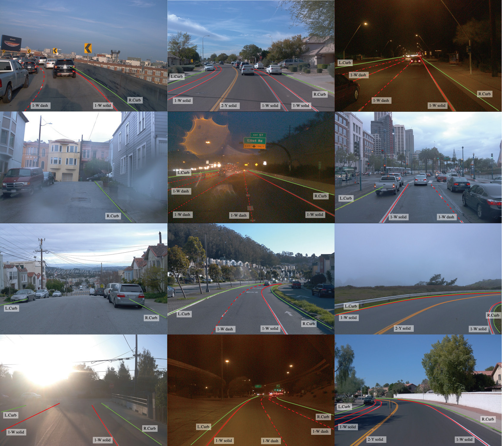

# Lane Annotation Criterion
Our principle for the lane detection task is to find all visible lanes inside left and right curbsides. Examples of visualizing lane annotation on 2D image are shown below.

 

## Data Format
Here's the data format for 2D/3D lane annotation. The evaluation can be referred from [here](../../eval/LANE_evaluation/README.md)
```
{
    "intrinsic":                            <float> [3, 3] -- camera intrinsic matrix
    "extrinsic":                            <float> [4, 4] -- camera extrinsic matrix
    "lane_lines": [                         (k lanes in `lane_lines` list)
        {
            "category":                     <int> -- lane category
                                                        1: 'white-dash',
                                                        2: 'white-solid',
                                                        3: 'double-white-dash',
                                                        4: 'double-white-solid',
                                                        5: 'white-ldash-rsolid',
                                                        6: 'white-lsolid-rdash',
                                                        7: 'yellow-dash',
                                                        8: 'yellow-solid',
                                                        9: 'double-yellow-dash',
                                                        10: 'double-yellow-solid',
                                                        11: 'yellow-ldash-rsolid',
                                                        12: 'yellow-lsolid-rdash',
                                                        20: 'left-curbside',
                                                        21: 'right-curbside'
            "visibility":                   <float> [n, ] -- visibility of each point
            "uv":[                          <float> [2, n] -- 2d lane points under image coordinate
                [u1,u2,u3...],
                [v1,v2,v3...]
            ],
            "xyz":[                         <float> [3, n] -- 3d lane points under vehicle coordinate
                [x1,x2,x3...],
                [y1,y2,y3...],
                [z1,z2,z3...],

            ],
            "attribute":                    <int> -- left-right attribute of the lane
                                                        1: left-left
                                                        2: left
                                                        3: right
                                                        4: right-right
            "track_id":                     <int> -- lane tracking id
        },
        ...
    ],
    "file_path":                            <str> -- image path
}
```


## 2D/3D Lane Annotation Generation Workflow
1. The necessary high-quality 2D lane labels. They contain the final annotations of tracking ID, category, and 2D points ground truth. 
2. Then for each frame, the point clouds are first filtered with the original 3D object bounding boxes and then projected back into the corresponding image. We further keep those points related to 2D lanes only with a certain threshold.
3. With the help of the localization and mapping system, 3D lane points in frames within a segment could be spliced into long, high-density lanes. 
4. Points whose 2D projections are higher than the ending position of its 2D annotation are labeled as invisible.
5. A smoothing step is ultimately deployed to filtrate any outliers and generate the 3D labeling results.


## Note
### Occlusion
Lanes are often occluded by objects or invisible because of abrasion, but they are still valuable for the real application. Thus, we annotate lanes if parts of them are visible, meaning lanes with one side being occluded are extended, or lanes with invisible intermediate parts are completed, according to the context.
### Visibility
Visibility mainly relates to points in the far distance, rather than occlusion or abrasion. It's not needed in evaluation, but it helps the model to distinguish visible lane points from invisible ones.
### Topology
It is very common that the number of lanes changes, especially when lanes have complex topologies such as fork lanes in merge and split cases. Fork lanes are annotated as separate lanes with a common starting point (split) or ending point (merge) - two close adjacent lanes are desired for the lane detection methods.
### Category
We annotate each lane as one of the 14 lane categories. Note that traffic bollards are considered as curbside as well if they are not temporally placed.
### Tracking ID
We annotate a tracking ID for each lane which is unique across the whole segment. We believe this could be helpful for video lane detection or lane tracking tasks. 
### Left-Right Attribute
We also assign a number in 1-4 to the most important 4 lanes based on their relative position to the ego-vehicle. Basically, the left-left lane is 1, the left lane is 2, the right lane is 3, and the right-right lane is 4.
### Scene Case
We provide different splitting based on these themes: Up&Down case, Curve case, Extreme Weather case, Night case, Intersection case, and Merge&Split case. Up&Down case focuses on uphill/downhill roads. Curve case consists of different big curve roads. Extreme Weather, as its name explains, is composed of roads in rain. Night case aims at roads in dim light. Intersection case and Merge&Split case are the two common traffic scenes where lane topology is difficult.

